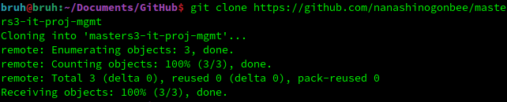

### Создание удалённого репозитория в GitHub

### Клонирование удалённого репозитория

### Создание новой ветки с последующим переключением на неё

### Удаление стартового файла, созданного при инициализации удалённого репозитория

### Создание файлов/папок в локальном репозитории

### Подготовка файлов к операции commit

### Операция commit

### Выгрузка содержимого локального репозитория в недавно созданную ветку удалённого репозитория

### Файлы выгружены и находятся в ветке task1 репозитория

### Переключение на основную ветку, слияние двух веток

### Слияние веток произошло успешно, файлы находятся в ветке main репозитория

### Удаление ветки task1

