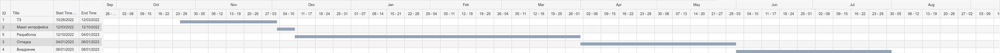

# Диаграмма Гантта:

# Потенциальные риски:

* Временные ограничения

* Возможность изменения требований к функциональности продукта в процессе разработки

* Внешние риски (например, изменение законодательной базы)
