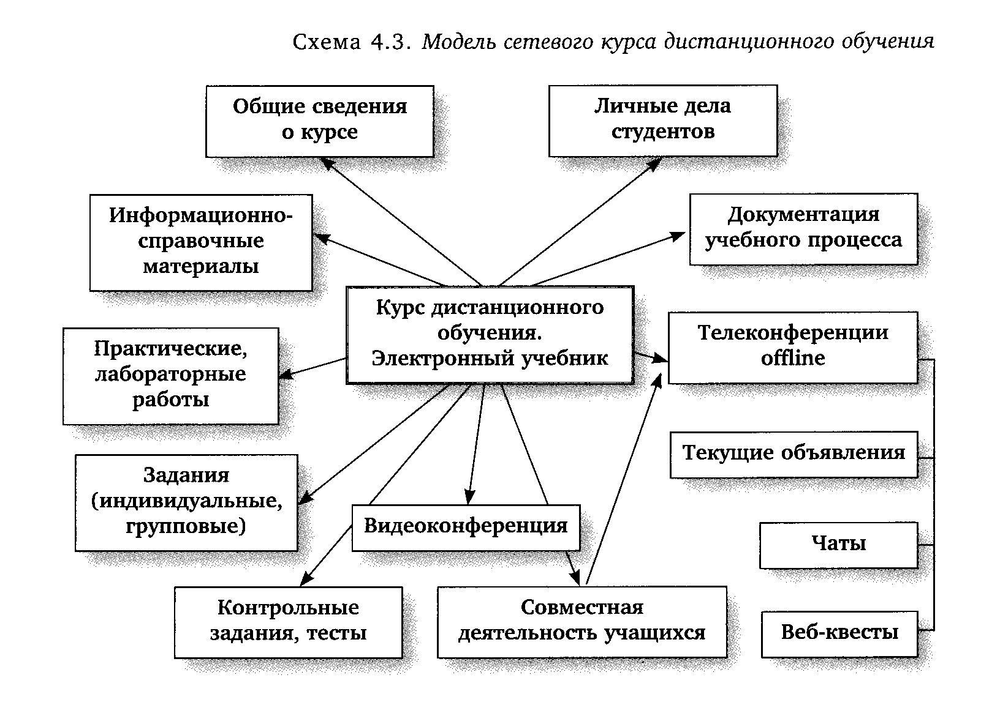

# Дистанционное обучение

## Определение

**Дистанционное обучение** — взаимодействие учителя и учащихся между собой на расстоянии, отражающее все присущие учебному процессу компоненты (цели, содержание, методы, организационные формы, средства обучения) и реализуемое специфичными средствами Интернет-технологий или другими средствами, предусматривающими интерактивность.

## Преимущества

- себестоимость дистанционной формы обучения несколько ниже традиционного образования, так как может отсутствовать арендная плата за наём помещений для проведения занятий, снижаются расходы на организацию самих занятий, существует возможность каждому преподавателю одновременно заниматься с несколько большим количеством обучающихся и отпадают некоторые другие факторы, прямо или косвенно влияющие на итоговую стоимость обучения;
- позволяет сократить время на обучение (сбор, время в пути);
- дистанционное обучение может носить индивидуальный характер, а следовательно предоставлять возможность более эффективно настроить процесс обучения, давая возможность обучающемуся самому себе подобрать удобные время и темп обучения;
- позволяет повысить качество обучения за счёт применения современных средств, объёмных электронных библиотек и т. д.;
- позволяет создать единую образовательную среду (особенно актуально для корпоративного обучения);
- такой формат обучения чрезвычайно удобен людям с ограниченными физическими возможностями;
- человек может в сжатые сроки одновременно обучаться более чем в одной образовательной организации и/или по более чем одному направлению;
- имеется возможность непрерывно повышать уровень собственной квалификации;
- активное использование изображений, текста, звука и видеоряда в учебном материале существенно повышает качество усвоения новой информации;
- применительно к Российской Федерации важным фактором может являться осуществление содействия развитию единого образовательного пространства на территории стран, где проживает русскоязычное население.

## Недостатки

Довольно внезапный вынужденный переход на новый формат обучения в четвёртой четверти учебного года 2019—2020 гг. выявил ряд дополнительных трудностей. Среди них следующее:
- недостаточный уровень обеспеченности компьютерной и иной техникой семей с детьми школьного возраста;
- недостаточный уровень выверенности информации на сайтах, имеющих своей целью создание платформ для обеспечения учебного процесса;
- отсутствие на отдельных сайтах заданий для некоторых параллелей классов;
- возникновение у преподавателей старшего возраста дополнительных трудностей в овладении современными компьютерными технологиями;
- снижение объективности оценивания знаний учащихся. Оценка знаний осуществлялась дистанционно, и зачастую у педагога могло не быть возможности установить степень самостоятельности выполнения учеником того или иного задания;
- пониженная мотивация у учащихся. Дети, которые в условиях очного обучения показывали относительно высокие результаты, в изменившихся условиях могли резко понизить свою успеваемость;
- подписка для учителей на ряде сайтов, имеющих своей целью создание платформ для обеспечения дистанционного учебного процесса, являлась платной;
- по причине резкого увеличения потока пользователей на учебных сайтах, на которых учителя предлагали выполнить задания в асинхронной форме дистанционного обучения, такие сайты в пиковые часы могли просто прекращать свою работу, в виду того, что сервера просто не выдерживали возросшей нагрузки.

## Формы

- Чат-занятия — учебные занятия, осуществляемые с использованием чат-технологий. Чат-занятия проводятся синхронно, то есть все участники имеют одновременный доступ к чату. В рамках многих дистанционных учебных заведений действует чат-школа, в которой с помощью чат-кабинетов организуется деятельность дистанционных педагогов и учеников.
- Веб-занятия — дистанционные уроки, конференции, семинары, деловые игры, лабораторные работы, практикумы и другие формы учебных занятий, проводимых с помощью средств телекоммуникаций и других возможностей «Всемирной паутины». Для веб-занятий используются специализированные образовательные веб-форумы — форма работы пользователей по определённой теме или проблеме с помощью записей, оставляемых на одном из сайтов с установленной на нём соответствующей программой. От чат-занятий веб-форумы отличаются возможностью более длительной (многодневной) работы и асинхронным характером взаимодействия учеников и педагогов.
- Телеконференция — проводится, как правило, на основе списков рассылки с использованием электронной почты. Для учебных телеконференций характерно достижение образовательных задач. Также существуют формы дистанционного обучения, при котором учебные материалы высылаются почтой в регионы. В основе такой системы заложен метод обучения, который получил название «Природный процесс обучения» (англ. natural learning manner). Дистанционное обучение — это демократичная простая и свободная система обучения. В 21 веке активно используется жителями Европы для получения дополнительного образования. Студент, постоянно выполняя практические задания, приобретает устойчивые автоматизированные навыки. Теоретические знания усваиваются без дополнительных усилий, органично вплетаясь в тренировочные упражнения. Формирование теоретических и практических навыков достигается в процессе систематического изучения материалов и прослушивания и повторения за диктором упражнений на аудио и видеоносителях (при наличии).
- Телеприсутствие. Существует много различных способов дистанционного обучения. Например, дистанционное присутствие с помощью робота R.Bot 100. В нашем времени технологий в Москве, в одной из школ, идёт эксперимент по такому виду дистанционного обучения. Мальчик-инвалид, находясь дома за компьютером, слышит, видит, разговаривает при помощи робота. Учитель задаёт ему вопросы, он отвечает. При этом и учитель видит ученика, потому что на роботе находится монитор. При этом у мальчика создаётся почти полное впечатление, что он находится в классе вместе со своими сверстниками на уроке. На переменах он может также общаться со своими одноклассниками. Если эксперимент станет удачным, он может открыть дорогу большому проекту по внедрению такого метода дистанционного обучения по всей России.

## Схема с последовательностью выполняемых операций при дистанционном обучении

